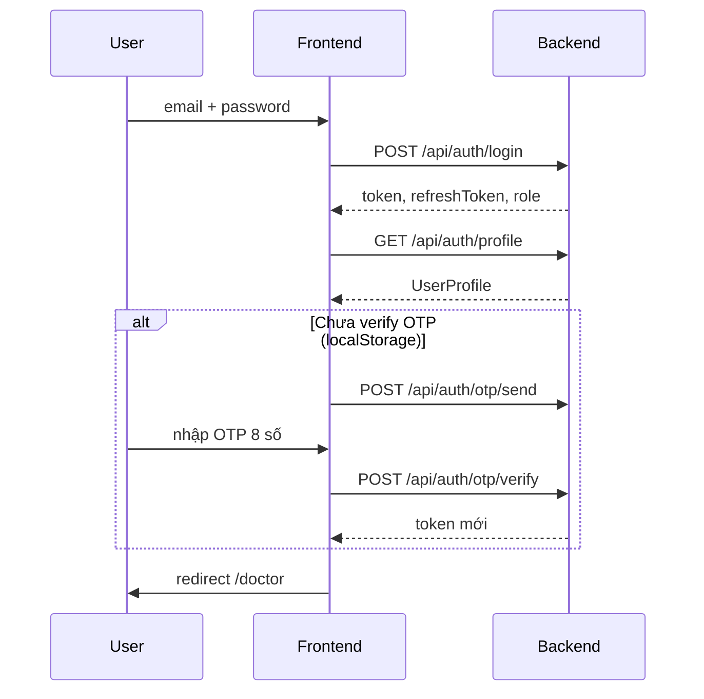

# TriageFlow Frontend — API Integration Guide

> **Backend mặc định**: `https://www.triageflow.me`  
> **Swagger UI**: [https://www.triageflow.me/api-docs](https://www.triageflow.me/api-docs)  
> **Branch**: `dev` · **Last updated**: 2026-07-08  
> **Source of truth trong code**: `shared/services/apiClient.ts`, `modules/auth/services/authService.ts`, `modules/clinical/services/clinicalService.ts`

---

## Mục lục

1. [Tổng quan kiến trúc](#1-tổng-quan-kiến-trúc)
2. [Định dạng response chung](#2-định-dạng-response-chung)
3. [Xác thực (Bearer token)](#3-xác-thực-bearer-token)
4. [Auth APIs](#4-auth-apis)
5. [Clinical / Doctor APIs](#5-clinical--doctor-apis)
6. [Luồng nghiệp vụ](#6-luồng-nghiệp-vụ)
7. [Mapping dữ liệu clinical](#7-mapping-dữ-liệu-clinical)
8. [Trang không gọi API](#8-trang-không-gọi-api)
9. [Cấu hình môi trường](#9-cấu-hình-môi-trường)
10. [Xử lý lỗi](#10-xử-lý-lỗi)
11. [Endpoint summary](#11-endpoint-summary)
12. [Swagger — toàn bộ backend](#12-swagger--toàn-bộ-backend)

---

## 1. Tổng quan kiến trúc

Frontend **không gọi thẳng** domain backend từ browser. Mọi request đi qua **Next.js rewrite proxy** để tránh CORS.

```
Browser                    Next.js dev/prod              Backend
───────                    ───────────────              ───────
fetch("/api/auth/login") → rewrite /api/:path*    →    https://www.triageflow.me/api/auth/login
```

### Base URL theo runtime

| Runtime | `API_BASE_URL` trong `apiClient` | Request thực tế |
|---------|----------------------------------|-----------------|
| **Browser** | `''` (same origin) | `/api/...` → proxy sang backend |
| **Server (SSR)** | `NEXT_PUBLIC_API_URL \|\| https://www.triageflow.me` | Gọi trực tiếp backend |

Cấu hình rewrite nằm tại `next.config.ts`:

```ts
source: '/api/:path*'
destination: `${backendUrl}/api/:path*`
```

### HTTP client

Tất cả API call đi qua `apiClient` (`shared/services/apiClient.ts`):

- `apiClient.get<T>(path, init?)`
- `apiClient.post<T>(path, body, init?)`
- `apiClient.patch<T>(path, body, init?)`

Header mặc định: `Content-Type: application/json`

---

## 2. Định dạng response chung

Backend trả về envelope thống nhất:

```ts
interface ApiResponse<T> {
    code: number;
    message: string;
    status: string;
    data: T;
}
```

Ví dụ thành công:

```json
{
  "code": 200,
  "message": "Success",
  "status": "OK",
  "data": { ... }
}
```

Khi HTTP status **không ok** (`!res.ok`), `apiClient` throw `ApiError` với:

- `statusCode`: HTTP status (401, 404, 500, …)
- `message`: lấy từ `json.message` hoặc fallback `"Request failed with status {status}"`

---

## 3. Xác thực (Bearer token)

Token được lưu trong Zustand store (`useAuthStore`) sau login/OTP:

| Field | Mô tả |
|-------|-------|
| `accessToken` | JWT dùng cho các API protected |
| `refreshToken` | Lưu cùng login, **chưa có logic refresh tự động** |

Header cho API cần auth:

```
Authorization: Bearer <accessToken>
```

### Endpoint cần token

| Endpoint | Token |
|----------|-------|
| `POST /api/auth/otp/send` | Optional (login flow có token) |
| `GET /api/auth/me` | Required |
| `GET /api/auth/profile` | Required |
| `PATCH /api/auth/update` | Required |
| `GET /api/doctor/patients` | Required |
| `GET /api/doctor/patients/queue/:id` | Required |

---

## 4. Auth APIs

Service: `modules/auth/services/authService.ts`  
Types: `shared/types/auth.types.ts`

---

### 4.1 POST `/api/auth/login`

**Mục đích**: Xác thực email/password, nhận token pair.

**Frontend**: `LoginForm.tsx`

**Auth**: Không cần

**Request body**:

```ts
interface LoginRequest {
    email: string;
    password: string;
}
```

**Response `data`**:

```ts
interface LoginResponseData {
    token: string;        // access token
    refreshToken: string;
    username: string;     // tên hiển thị tạm từ login
    role: string;         // e.g. DOCTOR, ADMIN
}
```

**Hành vi FE sau login**:

1. Gọi `GET /api/auth/profile` để lấy `full_name` và `id` thật từ DB
2. Lưu vào `useAuthStore`
3. Nếu email chưa verify OTP lần nào → gọi `POST /api/auth/otp/send` → chuyển sang bước OTP
4. Nếu đã verify trước đó (flag `localStorage: tfopd_otp_verified_{email}`) → redirect `/doctor`

---

### 4.2 POST `/api/auth/otp/send`

**Mục đích**: Gửi mã OTP 8 chữ số qua email.

**Frontend**: `LoginForm.tsx`, `OtpStep.tsx` (resend)

**Auth**: Optional — login flow gửi kèm `Authorization: Bearer {token}` từ bước login

**Request body**:

```ts
interface OtpSendRequest {
    email: string;
}
```

**Response `data`**: `null`

**Validation FE**: OTP phải đúng **8 chữ số**

---

### 4.3 POST `/api/auth/otp/verify`

**Mục đích**: Xác thực OTP sau login.

**Frontend**: `OtpStep.tsx`

**Auth**: Không cần (theo implementation hiện tại)

**Request body**:

```ts
interface OtpVerifyRequest {
    email: string;
    otp: string;   // 8 digits
}
```

**Response `data`**: Cùng shape với login

```ts
type OtpVerifyResponseData = LoginResponseData;
// { token, refreshToken, username, role }
```

**Hành vi FE**: Lưu flag OTP verified vào localStorage, cập nhật auth store, redirect `/doctor`

---

### 4.4 POST `/api/auth/register`

**Mục đích**: Đăng ký tài khoản nhân viên/bệnh nhân mới.

**Frontend**: `RegisterForm.tsx`

**Auth**: Không cần

**Request body**:

```ts
interface RegisterRequest {
    email: string;
    full_name: string;
    dob: string;          // DD-MM-YYYY (FE convert từ input date YYYY-MM-DD)
    password: string;
    gender: 'MALE' | 'FEMALE' | 'OTHER';
    citizen_id: string;   // FE validate tối thiểu 9 ký tự
    role: StaffRole;
    phone?: string;
}

type StaffRole =
    | 'USER' | 'DOCTOR' | 'NURSE' | 'RECEPTIONIST'
    | 'LAB_STAFF' | 'PHARMACY_STAFF' | 'CASHIER' | 'ADMIN';
```

**Response `data`**:

```ts
interface RegisterResponseData {
    email: string;
    id: string;
}
```

**Lưu ý**: Sau đăng ký FE hiển thị màn hình yêu cầu xác thực email qua mail confirm (không gọi thêm API).

---

### 4.5 GET `/api/auth/me`

**Mục đích**: Lấy thông tin user hiện tại (role từ DB).

**Frontend**: **Đã define trong service, chưa được component nào gọi**

**Auth**: Required

**Response `data`**:

```ts
interface AuthUser {
    id: string;
    email: string;
    fullName?: string;
    role: string;
    avatar?: string;
}
```

> FE hiện dùng `GET /api/auth/profile` thay cho `/me` trong login flow.

---

### 4.6 GET `/api/auth/profile`

**Mục đích**: Lấy profile đầy đủ của user đang đăng nhập.

**Frontend**: `LoginForm.tsx` (sync profile sau login), `app/(staff)/settings/page.tsx`

**Auth**: Required

**Response `data`**:

```ts
interface UserProfile {
    id: string;
    full_name: string;
    email: string;
    dob: string;          // ISO: 2004-04-07T00:00:00.000Z
    role: string;
    gender: 'MALE' | 'FEMALE' | 'OTHER';
    citizen_id: string;
    createdAt: string;
    updatedAt: string;
    phone?: string;
}
```

**FE mapping**: `dob` ISO → `YYYY-MM-DD` cho input `type="date"`

---

### 4.7 PATCH `/api/auth/update`

**Mục đích**: Cập nhật profile cá nhân.

**Frontend**: `app/(staff)/settings/page.tsx`

**Auth**: Required

**Request body**:

```ts
interface UpdateProfileRequest {
    full_name: string;
    dob: string;          // DD-MM-YYYY (FE convert từ YYYY-MM-DD)
    gender: 'MALE' | 'FEMALE' | 'OTHER';
    phone?: string;
}
```

**Response `data`**: `UserProfile` (cùng shape GET profile)

**Lưu ý**: Cấu hình máy in (`defaultPrinter`, `paperSize`) **chỉ lưu localStorage**, không gửi lên API.

---

### 4.8 POST `/api/auth/forgot`

**Mục đích**: Gửi OTP reset mật khẩu.

**Frontend**: `ForgotPasswordForm.tsx` (bước 1 + resend)

**Auth**: Không cần

**Request body**:

```ts
interface ForgotPasswordRequest {
    email: string;
}
```

**Response `data`**: `null`

---

### 4.9 POST `/api/auth/forgot/verify`

**Mục đích**: Xác thực OTP và đặt mật khẩu mới.

**Frontend**: `ForgotPasswordForm.tsx` (bước 2)

**Auth**: Không cần

**Request body**:

```ts
interface ForgotPasswordVerifyRequest {
    email: string;
    otp: string;       // 8 digits
    password: string;  // FE validate tối thiểu 8 ký tự
}
```

**Response `data`**: `null`

---

## 5. Clinical / Doctor APIs

Service: `modules/clinical/services/clinicalService.ts`  
Types backend: `BackendQueuePatient` (trong service file)  
Types frontend: `modules/clinical/types/clinical.types.ts` → `Patient`

---

### 5.1 GET `/api/doctor/patients?date={YYYY-MM-DD}`

**Mục đích**: Lấy danh sách bệnh nhân trong hàng đợi của bác sĩ theo ngày.

**Frontend**: `DoctorDashboard.tsx`

**Auth**: Required

**Query params**:

| Param | Format | Ví dụ |
|-------|--------|-------|
| `date` | `YYYY-MM-DD` | `2026-07-07` |

**Response `data`**: `BackendQueuePatient[]`

**Cấu trúc `BackendQueuePatient`** (rút gọn):

```ts
interface BackendQueuePatient {
    queue_id: string;
    queue_number: string;
    status: string;
    step: {
        step_id: string;
        next_step_id: string | null;
        step_status: string;
        docNo: number;
        payment_status: string;
        flow: {
            flow_id: string;
            status: string;
            booking: {
                booking_id: string;
                status: string;
                slot: {
                    slot_id: string;
                    start_time: string;
                    end_time: string;
                    shift: { date: string };
                };
                patient: {
                    patient_id: string;
                    medical_coverage_id: string | null;
                    account: {
                        full_name: string;
                        citizen_id: string;
                        email: string;
                        dob: string;
                        gender: string;   // MALE | FEMALE
                        role: string;
                        phone: string | null;
                    };
                };
            };
        };
    };
}
```

**FE behavior**:

- Tab ngày: hôm nay + 4 ngày trước
- Map qua `mapBackendPatientToFrontend()` → `Patient[]`
- `Patient.id` = `queue_id` (dùng cho routing `/doctor/{id}`)

---

### 5.2 GET `/api/doctor/patients/queue/{queueId}`

**Mục đích**: Lấy chi tiết một bệnh nhân theo `queue_id`.

**Frontend**:

- `app/(staff)/doctor/[id]/page.tsx`
- `app/(staff)/tongquan/patient/[id]/page.tsx`

**Auth**: Required

**Path params**:

| Param | Mô tả |
|-------|-------|
| `queueId` | UUID queue từ danh sách patients |

**Response `data`**: `BackendQueuePatient` (1 object)

**FE behavior**: Map qua `mapBackendPatientToFrontend()` → hiển thị EMR layout

---

## 6. Luồng nghiệp vụ

### 6.1 Login + OTP



### 6.2 Quên mật khẩu

```
POST /api/auth/forgot          { email }
        ↓
POST /api/auth/forgot/verify   { email, otp, password }
        ↓
Redirect /login
```

### 6.3 Doctor dashboard

```
GET /api/doctor/patients?date=2026-07-07
        ↓
User click row
        ↓
GET /api/doctor/patients/queue/{queue_id}
        ↓
EMR page (/doctor/[id] hoặc /tongquan/patient/[id])
```

---

## 7. Mapping dữ liệu clinical

Hàm `mapBackendPatientToFrontend()` (`clinicalService.ts`) chuyển `BackendQueuePatient` → `Patient`.

| Backend field | Frontend `Patient` field | Ghi chú |
|---------------|--------------------------|---------|
| `queue_id` | `id` | Dùng routing |
| `queue_number` | `stt` | Pad 2 chữ số |
| `account.full_name` | `name` | |
| `account.dob` | `age` | Tính tuổi |
| `account.gender` | `gender` | `FEMALE` → `Nữ`, còn lại → `Nam` |
| `account.citizen_id` | `code` | Fallback `BN-{patient_id}` |
| `slot.start_time` | `time` | |
| `status`, `step.step_status` | `status` | Map sang `Đang chờ` / `Đang khám` / `Đã khám` |

### Dữ liệu mock (không từ API)

Các field sau được **hardcode** trong mapper, chưa có endpoint backend tương ứng:

- `visitReason`, `allergies`, `medicalHistory`
- `vitals` (heartRate, bloodPressure, temperature, spO2)
- `medicalRecord.physicalExam`
- `priority`, `visitType`

UI EMR (`RightMedicalArea`, tabs khám bệnh, đơn thuốc…) hiện render từ data đã map + mock này.

---

## 8. Trang không gọi API

| Trang / Module | Ghi chú |
|----------------|---------|
| `app/kiosk/page.tsx` | UI kiosk self-service thuần mock, không `fetch` |
| Printer settings | Chỉ `localStorage` (`tfopd_default_printer`, `tfopd_paper_size`) |
| Avatar | `localStorage` key `tfopd_avatar` |
| OTP skip flag | `localStorage` key `tfopd_otp_verified_{email}` |
| Logout | `shared/services/authService.ts` — chỉ xóa token khỏi storage, không gọi API |

---

## 9. Cấu hình môi trường

Tạo file `.env.local` ở root project:

```env
# Backend URL — dùng cho SSR và Next.js rewrite
NEXT_PUBLIC_API_URL=https://www.triageflow.me
```

| Biến | Mặc định | Mô tả |
|------|----------|-------|
| `NEXT_PUBLIC_API_URL` | `https://www.triageflow.me` | Base URL backend |

**Dev local backend** (ví dụ backend chạy port 8080):

```env
NEXT_PUBLIC_API_URL=http://localhost:8080
```

Restart `next dev` sau khi đổi env.

---

## 10. Xử lý lỗi

### Trong `apiClient`

```ts
if (!res.ok) {
    throw new ApiError(res.status, json.message || `Request failed with status ${res.status}`);
}
```

### Trong components

Pattern chung:

```ts
try {
    const res = await authService.getProfile(accessToken);
    // dùng res.data
} catch (err) {
    const message = err instanceof Error ? err.message : 'Fallback message';
    // hiển thị toast / inline error
}
```

### HTTP status thường gặp

| Status | Ý nghĩa thường gặp |
|--------|---------------------|
| `401` | Token hết hạn / chưa đăng nhập |
| `403` | Không đủ quyền (role) |
| `404` | Không tìm thấy patient/queue |
| `422` / `400` | Validation error (email, OTP, password…) |

> **Chưa implement**: token refresh tự động khi 401. User cần login lại.

---

## 11. Endpoint summary

| # | Method | Endpoint | Auth | FE đang dùng |
|---|--------|----------|------|--------------|
| 1 | POST | `/api/auth/login` | — | ✅ LoginForm |
| 2 | POST | `/api/auth/otp/send` | Optional | ✅ LoginForm, OtpStep |
| 3 | POST | `/api/auth/otp/verify` | — | ✅ OtpStep |
| 4 | POST | `/api/auth/register` | — | ✅ RegisterForm |
| 5 | GET | `/api/auth/me` | Bearer | ❌ Chưa dùng |
| 6 | GET | `/api/auth/profile` | Bearer | ✅ LoginForm, Settings |
| 7 | PATCH | `/api/auth/update` | Bearer | ✅ Settings |
| 8 | POST | `/api/auth/forgot` | — | ✅ ForgotPasswordForm |
| 9 | POST | `/api/auth/forgot/verify` | — | ✅ ForgotPasswordForm |
| 10 | GET | `/api/doctor/patients?date=` | Bearer | ✅ DoctorDashboard |
| 11 | GET | `/api/doctor/patients/queue/:id` | Bearer | ✅ doctor/[id], tongquan/patient/[id] |

**Tổng**: 11 endpoint được define · **10 endpoint đang active** · **1 endpoint chưa dùng** (`/api/auth/me`)

---

## 12. Swagger — toàn bộ backend

Mở Swagger để xem schema request/response đầy đủ và test trực tiếp:

**[https://www.triageflow.me/api-docs](https://www.triageflow.me/api-docs)**

### Module trên Swagger vs FE đang dùng

| Module Swagger | FE đã tích hợp? | Ghi chú |
|----------------|-----------------|---------|
| **Auth** | Một phần | Thiếu: `login/citizen`, `refresh`, `logout` |
| **Doctor** | Một phần | Chỉ dùng `patients`, `patients/queue/{id}` |
| **Booking** | ❌ | Tiếp nhận / đặt lịch — chưa có trên FE |
| **Slot / Shift** | ❌ | Lịch khám — chưa có |
| **Transaction** | ❌ | Thanh toán QR — chưa có |
| **Staff / Account** | ❌ | Quản lý nhân sự — chưa có |
| **Room / Specialty** | ❌ | Cấu hình phòng/khoa — chưa có |
| **Flow** | ❌ | Workflow khám — chưa có |
| **Infermedica** | ❌ | AI triệu chứng — chưa có |
| **TriageConfig** | ❌ | Cấu hình phân loại — chưa có |
| **Vnpt** | ❌ | VNPT key — chưa có |

### Auth endpoints trên Swagger (đầy đủ)

| Method | Endpoint | FE |
|--------|----------|-----|
| POST | `/api/auth/register` | ✅ |
| POST | `/api/auth/login` | ✅ |
| POST | `/api/auth/login/citizen` | ❌ |
| POST | `/api/auth/otp/send` | ✅ |
| POST | `/api/auth/otp/verify` | ✅ |
| POST | `/api/auth/forgot` | ✅ |
| POST | `/api/auth/forgot/verify` | ✅ |
| POST | `/api/auth/refresh` | ❌ |
| POST | `/api/auth/logout` | ❌ (FE chỉ xóa token local) |
| GET | `/api/auth/profile` | ✅ |
| PATCH | `/api/auth/update` | ✅ |

> Không có nhóm `/api/reception/*` trên Swagger. Workflow lễ tân có thể nằm trong **Booking**, **Slot**, **Flow**.

---

## File liên quan

```
shared/
├── services/apiClient.ts          # HTTP client + ApiResponse type
├── constants/config.ts            # API_BASE_URL constant
└── types/auth.types.ts            # Request/response types auth

modules/
├── auth/services/authService.ts   # Auth API calls
└── clinical/services/clinicalService.ts  # Doctor API calls + mapper

next.config.ts                     # Rewrite proxy /api/*
```

---

## Changelog docs

| Ngày | Thay đổi |
|------|----------|
| 2026-07-07 | Tạo tài liệu ban đầu theo branch `dev` @ `d283871` |
| 2026-07-08 | Thêm link Swagger + bảng module backend chưa tích hợp FE |
